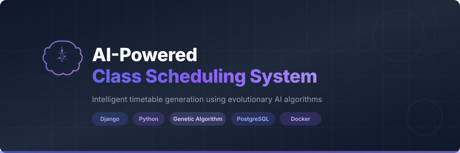

<p align="center">
  
</p>

<h3 align="center">Intelligent timetable generation powered by evolutionary AI algorithms</h3>

<p align="center">
  <a href="#quick-start">Quick Start</a> |
  <a href="#ai-powered-features">Features</a> |
  <a href="#ai-technology">AI Technology</a> |
  <a href="#deployment">Deployment</a> |
  <a href="#documentation">Docs</a>
</p>

---

## Quick Start

### Prerequisites

- Python 3.8+
- PostgreSQL (production) or SQLite (development)
- Git

### 1. Clone & Setup

```bash
git clone <repository-url>
cd AI-Powered-Class-Scheduling-System

# Create virtual environment
python -m venv venv
# Windows
.\venv\Scripts\activate
# Linux/Mac
source venv/bin/activate

# Install dependencies
pip install -r requirements.txt
```

### 2. Configure Environment

```bash
cp .env.example .env
```

Edit `.env` with your settings:

```env
SECRET_KEY=your-generated-secret-key
DJANGO_ENV=development
DEBUG=True
ALLOWED_HOSTS=localhost,127.0.0.1
DB_NAME=ai_scheduling
DB_USER=postgres
DB_PASSWORD=your-db-password
DB_HOST=localhost
DB_PORT=5432
CONTACT_EMAIL=admin@example.com
```

Generate a secret key:
```bash
python -c "from django.core.management.utils import get_random_secret_key; print(get_random_secret_key())"
```

### 3. Setup Database & Admin

```bash
python manage.py migrate
python manage.py create_initial_admin
```

### 4. Run

```bash
python manage.py runserver
```

Visit: http://127.0.0.1:8000/

---

## AI-Powered Features

- **Intelligent Timetable Generation** — Genetic algorithm creates optimal conflict-free schedules automatically
- **Smart Resource Management** — AI-driven allocation of instructors, rooms, courses, departments, batches, and sections
- **Automated Conflict Resolution** — Detects and resolves room, instructor, and time slot conflicts
- **Fitness-Based Optimization** — Evaluates schedules against capacity, double-booking, and instructor constraints
- **PDF Export** — Generate and download optimized timetables as PDFs
- **Role-Based Access Control** — Staff-only admin operations with secure authentication

## AI Technology

The system employs **Genetic Algorithms**, a class of evolutionary algorithms inspired by natural selection:

| Concept | Implementation |
|---------|---------------|
| **Population** | 9 candidate schedules maintained simultaneously |
| **Fitness Function** | `1 / (conflicts + 1)` — penalizes room capacity, double-booking, and instructor conflicts |
| **Selection** | Tournament selection (size 3) picks parents for crossover |
| **Crossover** | Uniform crossover combines scheduling patterns from two parents |
| **Mutation** | 5% mutation rate introduces random variations to escape local optima |
| **Elitism** | Top 1 schedule preserved each generation |
| **Convergence** | Evolves up to 1000 generations or until fitness = 1.0 (zero conflicts) |

## Project Structure

```
├── apps/
│   ├── account/                    # Authentication & user management
│   │   ├── management/commands/    # Custom management commands
│   │   │   └── create_initial_admin.py
│   │   ├── authentication.py       # Email auth backend
│   │   ├── models.py              # User profile model
│   │   ├── views.py               # Auth & user CRUD views
│   │   └── templates/             # Auth templates
│   └── schedule/                  # Core scheduling app
│       ├── models.py              # Room, Instructor, Course, Batch, Section, etc.
│       ├── views.py               # CRUD, timetable generation, PDF, health check
│       ├── forms.py               # Model forms with validation
│       ├── render.py              # PDF rendering (xhtml2pdf)
│       └── services/
│           ├── genetic_algorithm.py     # GA engine (Data, Schedule, Population, GA)
│           └── timetable_generator.py   # Service layer orchestrating the GA
├── config/
│   ├── settings/
│   │   ├── base.py                # Shared settings
│   │   ├── development.py         # DEBUG=True, console email
│   │   ├── staging.py             # DEBUG=True, relaxed security
│   │   └── production.py          # DEBUG=False, PostgreSQL, HSTS, logging
│   ├── middleware.py              # Rate limiting & security headers
│   ├── urls.py                    # Root URL configuration
│   ├── wsgi.py / asgi.py
├── templates/                     # Project-wide templates (modern + legacy)
├── static/                        # CSS, JS, images
├── logs/                          # Production log files
├── Dockerfile                     # Container image
├── docker-compose.yml             # Full stack (web + PostgreSQL + nginx)
├── nginx.conf                     # Reverse proxy config
├── .github/workflows/ci.yml       # CI pipeline (lint, test, docker)
├── requirements.txt               # Production dependencies
└── requirements-dev.txt           # Dev dependencies (pytest, black, flake8)
```

## Tech Stack

| Layer | Technology |
|-------|-----------|
| **Backend** | Django 4.2.16, Python 3.8+ |
| **AI Engine** | Custom Genetic Algorithm (evolutionary AI) |
| **Database** | SQLite (dev) / PostgreSQL 15 (production) |
| **Frontend** | Bootstrap 5 (modern) / Bootstrap 4 (legacy), server-rendered HTML |
| **PDF** | xhtml2pdf, ReportLab |
| **Server** | Gunicorn (production), Django dev server (development) |
| **Proxy** | Nginx (production) |
| **Container** | Docker, Docker Compose |
| **CI/CD** | GitHub Actions (lint, test, docker build) |

## Security

Production settings include:

- `SECURE_SSL_REDIRECT` — Forces HTTPS
- `SECURE_HSTS_SECONDS = 31536000` — 1-year HSTS with preload
- `SESSION_COOKIE_SECURE` / `CSRF_COOKIE_SECURE` — Cookies only over HTTPS
- `SECURE_CONTENT_TYPE_NOSNIFF` — Prevents MIME sniffing
- Rate limiting on login (5 attempts/15 min) and registration (3 attempts/hour)
- Role-based access control — admin operations restricted to staff users
- `@require_POST` on all delete/logout endpoints (CSRF protection)
- PDF upload validation (type + size limits)
- Security headers middleware (X-Content-Type-Options, Referrer-Policy, Permissions-Policy)

## Deployment

### Docker (Recommended)

```bash
# Set environment variables in .env, then:
docker-compose up -d

# Create admin user
docker-compose exec web python manage.py create_initial_admin
```

This starts:
- **web** — Django app via Gunicorn (port 8000)
- **db** — PostgreSQL 15 with health checks
- **nginx** — Reverse proxy with static file serving (port 80)

### Manual Deployment

```bash
export DJANGO_ENV=production
pip install -r requirements.txt
python manage.py migrate
python manage.py collectstatic
python manage.py create_initial_admin
gunicorn config.wsgi:application --bind 0.0.0.0:8000 --workers 4
```

Set `DJANGO_ENV=production` and configure a reverse proxy (Nginx/Apache) in front.

### Health Check

```bash
curl http://localhost:8000/health/
# {"status": "ok", "database": "ok"}
```

## Common Commands

```bash
# Run development server
python manage.py runserver

# Create admin user (interactive)
python manage.py create_initial_admin

# Create admin user (non-interactive)
python manage.py create_initial_admin --username admin --email admin@example.com

# Database migrations
python manage.py makemigrations
python manage.py migrate

# Collect static files
python manage.py collectstatic

# System checks
python manage.py check
python manage.py check --deploy

# Run tests
pytest --cov=apps -v
```

## Usage

1. **Login** — Access `/manage/` and sign in with your admin credentials
2. **Add Resources** — From the dashboard, add departments, instructors, rooms, meeting times, and courses
3. **Create Batches** — Define batches and assign courses to them
4. **Define Sections** — Create sections with weekly class frequency
5. **Generate Timetable** — Click "Generate Timetable" and let the genetic algorithm create an optimized schedule
6. **Export** — View and download the generated timetable as PDF

## Documentation

- [Full Documentation](docs/README.md) — Complete project documentation
- [AI Features](docs/AI_FEATURES.md) — Detailed AI capabilities and algorithms
- [Architecture Guide](docs/ARCHITECTURE.md) — System design and patterns
- [Quick Reference](docs/QUICK_REFERENCE.md) — Common commands and tips

## Contributing

1. Fork the repository
2. Create a feature branch (`git checkout -b feature/amazing-feature`)
3. Install dev dependencies (`pip install -r requirements-dev.txt`)
4. Make your changes
5. Run linting (`black . && isort . && flake8 apps/ config/`)
6. Run tests (`pytest --cov=apps -v`)
7. Commit and push (`git push origin feature/amazing-feature`)
8. Open a Pull Request

## License

Open-source AI-powered scheduling solution for educational institutions.
